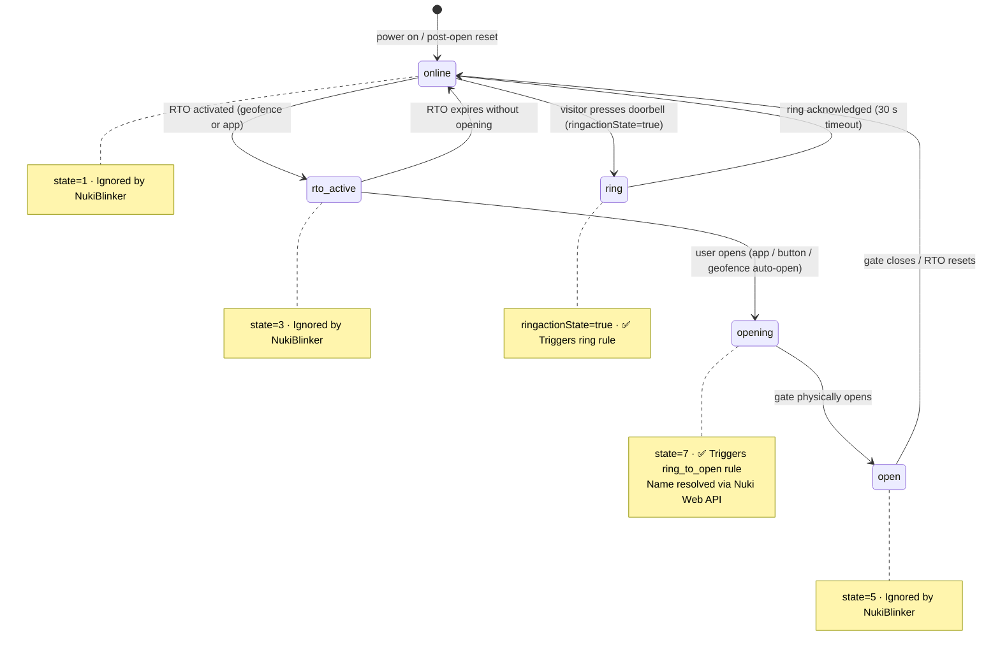
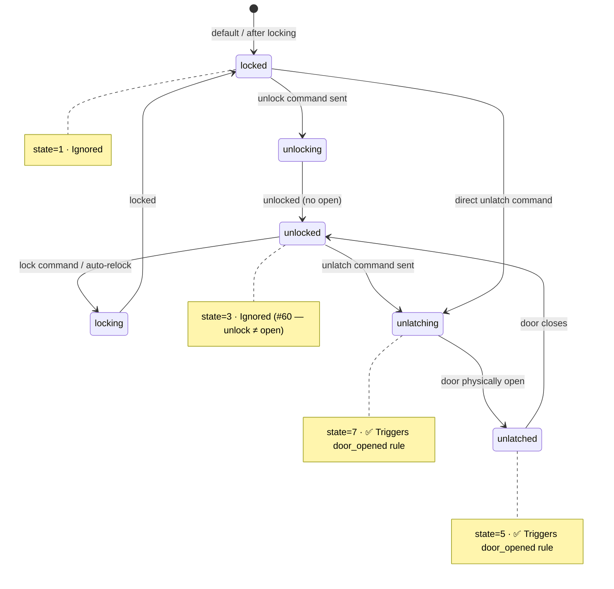

# Product Spec — NukiBlinker

## Vision

A lightweight, always-on service that reacts to Nuki smart lock events — blinking Philips Hue lights, playing chimes and announcements on Google Nest speakers, and sending Apple HomeKit doorbell alerts. Different events trigger different actions.

## Problem

Nuki devices (Opener + Smart Lock) handle doorbell and door events but have no built-in way to trigger visual or audio alerts on other smart home devices. In a large house or when wearing headphones, the intercom ring or door opening can be missed. NukiBlinker bridges this gap with configurable reactions: different blink patterns, chimes, voice announcements, and push notifications depending on the event type.

## Users

Individual homeowner running a Nuki Opener and/or Nuki Smart Lock, plus one or more of: Philips Hue Bridge, Google Nest speakers, Apple HomeKit devices — all on the same local network.

## How It Works (User Perspective)

1. User configures NukiBlinker via the web UI (bridges, speakers, event rules).
2. NukiBlinker starts and registers a webhook callback on the Nuki Bridge.
3. An event occurs on a Nuki device (doorbell ring, door opened, etc.).
4. Nuki Bridge sends an HTTP callback to NukiBlinker.
5. NukiBlinker identifies the event type and fires the matching rule:
   - **Ring (unknown visitor)**: Hue lights blink with a warning pattern.
   - **Ring to open (authorized person)**: Different blink + personalized announcement ("{name} llegó a casa").
   - **Door opened (Smart Lock)**: Chime sound on speakers.
6. Lights return to their previous state after the blink sequence.

## Lifecycle

| Action | How | What happens |
|---|---|---|
| **Start** | `docker compose up -d` or `make runLocal` | Registers callback on Nuki Bridge, starts HomeKit accessory, begins listening. |
| **Stop** | `docker compose down` or Ctrl+C | Deregisters callback from Nuki Bridge, stops HomeKit, clean exit. |
| **Pause** | Web UI "Pause" button | Deregisters Nuki callback but keeps the service running. Web UI stays accessible. |
| **Resume** | Web UI "Resume" button | Re-registers the Nuki callback. Notifications resume. |

### Graceful shutdown

On `SIGTERM` or `SIGINT` (sent by Docker on stop), NukiBlinker:
1. Deregisters the callback from the Nuki Bridge.
2. Stops the HomeKit accessory driver.
3. Exits cleanly.

The Nuki Bridge does not retry or error when a callback URL is unreachable — it silently skips. So even on an ungraceful crash, there is no user-visible impact. On next startup, the stale callback is detected and reused (idempotent).

## Devices & APIs

| Device | Role | API / Protocol |
|---|---|---|
| Nuki Bridge | Pushes events via HTTP callback | [Nuki Bridge HTTP API](https://developer.nuki.io/page/nuki-bridge-http-api-1-13/4) |
| Nuki Opener | Detects doorbell ring (deviceType=2) | Via Nuki Bridge |
| Nuki Smart Lock | Detects door open/lock/unlock (deviceType=0) | Via Nuki Bridge |
| Philips Hue Bridge | Controls lights | [Hue CLIP API v2](https://developers.meethue.com/develop/hue-api-v2/) / v1 REST |
| Google Nest / Home | Chimes and voice announcements | Chromecast protocol (`pychromecast`) + TTS (`gTTS`) |
| Apple HomeKit | Doorbell notifications on iPhone/iPad/Watch/Mac | HomeKit Accessory Protocol (`HAP-python`) |

## Event Types

Nuki devices produce different events. NukiBlinker maps each to a configurable set of actions via **event rules**.

| Event | Nuki device | Meaning | Default actions |
|---|---|---|---|
| **Ring (no open)** | Opener (deviceType=2) | Unknown visitor rang the doorbell | Hue lights blink (warning pattern) |
| **Ring to open** | Opener (deviceType=2) | Authorized person arrived, door opened | Different blink + personalized announcement |
| **Door opened** | Smart Lock (deviceType=0) | Flat door was unlocked/opened | Chime or personalized announcement |

> **Ring detection (Opener)**: A doorbell ring is detected via the callback's `ringactionState`/`ringactionTimestamp` fields (per Bridge API §4 — the ring action flag, reset after 30 s), **not** via the lock `state`. The door being opened (Ring to Open / manual open) is signalled by `state == 7` ("opening"). All other Opener states (1 "online", 3 "rto active", 5 "open", 253 "boot run") are routine status updates and are **silently ignored** (#197).

### Nuki device state machines

The following diagrams show the operational states for each Nuki device and the NukiBlinker reactions. Calibration/error states (0 "uncalibrated/untrained", 254 "motor blocked", 255 "undefined") are omitted.

#### Opener (deviceType=2)

#### Smart Lock (deviceType=0)

> **Door sensor**: `doorsensorState=3` (door physically opened) also triggers `door_opened` independently of lock state (#169).

### Event Deduplication

A single real interaction makes the Nuki Bridge emit several callbacks (status transitions plus the ring/open). To avoid firing notifications multiple times for one event, NukiBlinker keeps an in-memory cache of recently processed events (default window 120 s) and suppresses duplicates.

- The dedup key is `(nukiId, event_type, discriminator)` where the discriminator is the **`ringactionTimestamp`** for rings and the lock **`state`** otherwise.
- Because a genuine second ring carries a **new** `ringactionTimestamp`, ringing twice still produces two notifications — only repeated callbacks for the *same* ring/open are collapsed.
- **Ring-to-Open correlation (#121)**: a single Ring-to-Open makes the Opener emit two callbacks ~10 s apart that classify as *different* event types — a `ring_to_open` (state 7) and a `ring` (`ringactionState` true) — so the per-type key above would let both fire. Since every Opener callback carries the same `ringactionTimestamp` (the ring that triggered the open), NukiBlinker also suppresses a second ring-family event sharing `(nukiId, ringactionTimestamp)` within the window, collapsing one RTO into a single notification. Two genuinely distinct rings carry different timestamps and are never collapsed.
- Suppressed events are recorded in the Event Log with the reason, so the behaviour is auditable.

### Person Identification

For **Opener** events (**ring** and **ring to open**) NukiBlinker resolves which user triggered the action and exposes it as a `{name}` template variable in the TTS message. **Door opened** (Smart Lock) events deliberately do **not** resolve a name — their only actions are a chime/blink and the opener identity is irrelevant (#176).

- **Nuki Web API only** (#175): names are resolved **exclusively** through the Nuki Web API activity log, which reliably returns `name`, `trigger`, and `source`. This also tells *how* the door was opened (e.g. physical button vs Ring to Open). The local Bridge `/log` endpoint is **no longer** used for name resolution.
- The Nuki Web API can lag a few seconds behind the Bridge callback (#193). NukiBlinker retries the log query up to **7 times** (2 s apart, ~14 s total) when the most recent candidate entry is older than 10 s relative to the `ringactionTimestamp`. This ensures the correct visitor name is returned even if the Web API hasn't propagated the event yet.
- When the Web API is not configured, or no named entry arrives within the retry window (e.g. an anonymous Ring-to-Open), NukiBlinker falls back to `fallback_name` ("Alguien").
- Every Nuki Web request and response is logged at **INFO** so name resolution can be troubleshot from the standard logs.

Examples:
- Template: `"{name} llegó a casa"` → Announcement: "Nico llegó a casa"
- Template: `"{name} ha abierto la puerta"` → Announcement: "Ele ha abierto la puerta"
- If the name cannot be resolved (log unavailable, unknown trigger), falls back to a default: "Alguien llegó a casa".

Each event rule configures:
- Which **notification channels** to fire (checkboxes).
- Which **blink pattern** to use (none, short, or long).
- Which **audio** to play: chime (bundled sound), TTS (template message with `{name}`), or none.
- Whether to send a **HomeKit** notification.

Example configuration:

| | Ring (no open) | Ring to open | Door opened |
|---|---|---|---|
| Hue Lights | ✅ Red flash, 5x | ✅ Green flash, 2x | ❌ |
| Audio | ❌ | ✅ TTS "{name} llegó a casa" | ✅ Chime |
| HomeKit Notification | ✅ | ✅ | ❌ |

## Blink Modes

Each event rule picks one of three blink modes. Both active modes use Hue's
native `alert` effect, so the bridge **restores each light's previous state**
(on/off, colour, brightness) automatically when the sequence ends.

### `none`
- No blink.

### `short` — single cycle
- Uses Hue's native `"alert": "select"` — a single "breathe" cycle (one blink).
- For quick, low-disruption notifications.

### `long` — 15-second cycle
- Uses Hue's native `"alert": "lselect"` — the ~15-second "breathe" cycle.
- For attention-grabbing alerts.

The number of blinks is fixed by the Hue bridge for each mode and is not
configurable. A future hardcoded blink pattern may be added in code (no config
surface); it would also save and restore each light's state.

> **Removed (Unreleased)**: the previous configurable `custom` pattern (color /
> flash count / interval) was removed — its save/restore was unreliable. Use
> `short` or `long` instead.

## Notification Channels

All enabled channels fire in parallel. Each event rule selects which channels to trigger.

| Channel | Type | What happens | Required hardware |
|---|---|---|---|
| **Hue Lights** | Visual | Lights blink (per-event pattern) | Hue Bridge |
| **Audio** | Sound | Chime or TTS message on speakers | Google Nest (Chromecast) |
| **Apple HomeKit** | Push notification | Native doorbell alert on all Apple devices | iPhone/iPad/Watch/Mac |

### Audio (Chimes & Announcements)

Plays sounds on **Google Nest** speakers. Two audio modes:

- **Chime** (`mode: chime`): Plays the single built-in chime (pleasant doorbell tone, `sounds/chime.wav`). No internet required. The chime is **fixed and not configurable** (#179) — there is no per-event chime filename and no fallback.
- **TTS** (`mode: tts`): Plays a custom spoken message via `gTTS`. Requires internet for first generation. Message is configurable per event rule and supports `{name}` template variable for personalized announcements. Generated `.mp3` files are **cached on a persistent volume** keyed by the message (#178), so repeated announcements replay instantly and offline.

Speaker support:
- **Google Nest / Home**: Uses Chromecast protocol via `pychromecast`. Speakers auto-discovered on LAN.
- Volume can be set independently of the speaker's current volume.

> **Note**: Apple HomePod / AirPlay output was removed in v0.4.x. HomePod owners still receive the ring via the HomeKit doorbell notification (which plays the built-in chime on the HomePod).

The single bundled chime lives in `nukiblinker/sounds/chime.wav` (generated at Docker build time, no committed binary). The persistent TTS cache lives under `cache/tts` (mounted as `./cache:/app/cache`, overridable via `NUKIBLINKER_TTS_CACHE_DIR`).

### Apple HomeKit Doorbell
- NukiBlinker exposes a virtual HomeKit doorbell accessory via `HAP-python`.
- On first setup, user scans the HomeKit pairing code from the web UI (or enters the setup code manually in the Home app).
- When a ring is detected, all paired Apple devices receive a native doorbell notification.
- No HomePod required — works with iPhone, iPad, Apple Watch, and Mac.

## Configuration

Settings are managed via a **web configuration page** served by NukiBlinker itself. Non-secret settings are persisted to `config.yaml` and **secrets are persisted to a separate `secrets.yaml`** (see *Secret storage* below).

Example templates `config.example.yaml` and `secrets.example.yaml` are provided for initial bootstrap (before the web UI is available).

### Secret storage (`secrets.yaml`)

Secrets (`nuki.api_token`, `nuki.web_api_token`, `hue.api_key`) are stored in a dedicated `secrets.yaml` next to `config.yaml`, never inline in `config.yaml`. This makes config rewrites safe by construction (#123): rewriting `config.yaml` from the UI can no longer wipe a stored secret.

- **Load**: `config.yaml` is read first, then `secrets.yaml` is overlaid on top (secrets win).
- **Save**: secret fields are split out of the dump — non-secrets go to `config.yaml` (with secret fields removed), secrets go to `secrets.yaml`.
- **Secret preservation**: on save, an empty or masked (`***`) secret never overwrites a stored value — the existing `secrets.yaml` value is preserved. A secret is only updated when a new non-empty value is provided.
- **Backward-compatible migration**: an old `config.yaml` that still carries inline secrets loads without error; on the next save the secrets are moved to `secrets.yaml` and stripped from `config.yaml`.
- `secrets.yaml` is git-ignored and mounted as its own Docker volume.

### Config hygiene (obsolete fields)

On save, fields that no longer apply are dropped from `config.yaml` (#123): `ring.audio.message` / `ring.audio.fallback_name` and `door_opened.audio.message` / `door_opened.audio.fallback_name` — there is never a known visitor name for a bare ring, and `door_opened` only plays a chime. Old configs with these fields load without error and are cleaned on the next save.

### Web Configuration UI

A simple, single-page web interface for configuring NukiBlinker.

**Access control**: The web UI is accessible from any private-network IP (localhost, Docker gateway, LAN). Requests from public IPs are rejected with `403 Forbidden`.

**Sections**:

1. **Nuki Bridge**
   - IP and port (auto-discovered if possible; manual fallback).
   - API token.
   - **Web API token** (optional, #141): a masked secret field to enter the Nuki **Web API** token used to resolve real user names/triggers for Ring-to-Open and Door-opened events. Stored in `secrets.yaml`; masked (`***`) on read and preserved on save like the other secrets.
   - Device picker — select which Opener and/or Smart Lock to listen to.

2. **Hue Bridge**
   - IP (auto-discovered if possible; manual fallback).
   - API key (with a "Press bridge button and pair" flow if no key exists).
   - Light/group picker — shows discovered lights and groups with checkboxes.

3. **Speakers**
   - Speaker picker — shows auto-discovered Google Nest (Chromecast) devices with checkboxes.
   - Volume override (slider).
   - "Test announce" button.

4. **Apple HomeKit**
   - Enable/disable HomeKit doorbell.
   - Pairing status and HomeKit setup code / QR code for initial pairing.
   - "Test notification" button.

5. **Event Rules**
   - One card per event type (Ring, Ring to open, Door opened).
   - Each card configures:
     - Hue: enable + blink mode (`none` / `short` / `long`).
     - Audio: **Ring** (unknown visitor) and **Door opened** are **chime-only**; **Ring to open** supports TTS (`{name}` message) or chime (#125). The chime itself is fixed (no filename input, #179).
     - HomeKit: enable/disable.
   - Also on this tab: **Event Validation** (drop stale callbacks) and **Deduplication** (collapse repeated callbacks from one interaction) as two clearly-separated cards (#125).
   - "Test" button per event rule (fires all enabled channels for that rule).

6. **Status**
   - Connection status for all bridges and speakers (reachable / unreachable).
   - Last event timestamp and type.
   - Service uptime.
   - Pause / Resume button.

7. **General** (#124)
   - Application logging: log file path, rotation, number of backups kept.
   - GitHub integration: repository, Personal Access Token (masked secret), default support-bundle window.

8. **Event Log**
   - Event logging settings (enable, max entries, retention, persist to file) — relocated here from the Events tab (#125).
   - Paginated event-log viewer with a device filter (labelled by **name + type + ID**), an **only-events-with-actions** filter, a per-entry device-type badge, and CSV export (#181).
   - **Send support bundle to GitHub** (#117): pick a reference time + window (± minutes); NukiBlinker zips the app-log slice + event-log entries in the window and opens a GitHub issue with the ZIP attached (link committed via the Contents API). Requires a GitHub token (General tab); the config summary in the issue is redacted.

**Auto-discovery**:
- Nuki Bridge: discovered via Nuki Cloud discovery endpoint (`https://api.nuki.io/discover/bridges`) or local UDP broadcast.
- Hue Bridge: discovered via mDNS (`_hue._tcp.local`) or Philips discovery endpoint (`https://discovery.meethue.com`).
- Google Nest / Chromecast speakers: discovered via `pychromecast` (mDNS/zeroconf).
- If auto-discovery finds a device, the IP / name is pre-filled. User can always override manually.

### Config file (`config.yaml`)

Key settings:
- **Nuki Bridge**: IP, port, API token, optional Opener ID filter.
- **Hue Bridge**: IP, API key, list of light IDs and/or group IDs to blink.
- **Speakers**: list of Chromecast speaker names/IPs, volume.
- **HomeKit**: enabled flag, pairing state/code.
- **Nuki Smart Lock**: optional Smart Lock ID filter.
- **Event rules**: per-event config (channels enabled, blink pattern, audio mode/message).
- **Server**: host and port for the callback listener.
- **Logging**: level, file path.

## Acceptance Criteria

1. **Event detection** — Events from the Nuki Opener and Smart Lock trigger the callback within 2 seconds.
2. **Event classification** — Ring, Ring to open, and Door opened are correctly distinguished and routed to the matching rule.
3. **Light blink** — Configured Hue lights blink with the per-event pattern within 1 second of receiving the callback.
4. **State restore** — After a custom blink sequence, lights return to their exact previous state (on/off, brightness, color).
5. **Audio** — Chime or TTS plays on selected Google Nest speakers within 2 seconds.
6. **Person identification** — For ring-to-open and door-opened events, the user's name is resolved from the Nuki activity log and used in TTS templates.
7. **HomeKit** — Doorbell notification appears on all paired Apple devices within 2 seconds.
8. **Per-event rules** — Each event type has independently configurable channels, blink pattern, and audio mode/message.
9. **Resilience** — If a channel target is unreachable, NukiBlinker logs a warning but does not crash.
10. **Channel independence** — Each notification channel works independently; a failure in one does not block others.
11. **Idempotent startup** — Multiple restarts do not create duplicate callbacks on the Nuki Bridge.
12. **Config validation** — Invalid config is rejected at startup with a clear error message.
13. **Web UI** — Config page is accessible from private-network IPs (localhost, LAN). All settings are editable and persist to `config.yaml`.
14. **Auto-discovery** — Nuki Bridge, Hue Bridge, and Chromecast speakers are auto-discovered when available.
15. **Test buttons** — Per-event "Test" button fires all enabled channels for that rule without a real doorbell event.
16. **Graceful shutdown** — `docker compose down` deregisters the Nuki callback before exiting.
17. **Pause/Resume** — Web UI pause button deregisters callback without stopping the service; resume re-registers it.
18. **Tests** — Unit tests cover event classification, person identification, all notification channels, event rules, config validation, web UI access control, and shutdown hook.
19. **Lint** — `make lint` passes with zero errors.

## Non-Goals (Current)

- No integration with Nuki Cloud API for control (local bridge only). The Nuki **Web API** is used read-only and **optionally** (when a token is configured) to resolve user names/triggers for the activity log; it never opens or locks doors.
- No Alexa support (no public local API for announcements).
- No multi-bridge support (single Nuki Bridge + single Hue Bridge).
- No door-opening automation — NukiBlinker is notification only, it never opens or locks doors.
- No remote access to the web UI from public IPs — private networks only (localhost, LAN).

## New Features (v0.3.0)

### Event Timestamp Validation (#59)

**Problem**: Sometimes there can be significant delays between when an event occurs and when NukiBlinker processes it, leading to notifications that are no longer relevant.

**Solution**: Add configurable timestamp validation that checks the time difference between event occurrence and processing. If the delay exceeds a configurable threshold (in seconds), the event is ignored and logged.

**Configuration**:
- New setting in web UI: "Maximum event delay (seconds)" with default 60 seconds
- Validation is a single global toggle (`event_validation.enabled`) applied to all events — not per event type
- Events exceeding threshold are logged with warning but don't trigger notifications

### Event Log Viewer (#57)

**Problem**: When troubleshooting issues, there's no way to see what events were received, how they were processed, and what actions were taken.

**Solution**: Implement a persistent event log accessible via the web UI that captures detailed information about each event.

**Features**:
- Web UI "Event Log" tab showing chronological list of events
- Each log entry includes:
  - Timestamp (when event was received)
  - Event type (Ring, Ring to Open, Door Opened)
  - Full Nuki callback payload
  - Processing result (actions taken or skipped with reason)
- Log retention: configurable (default 7 days, max 30 days)
- Export functionality: download log as CSV
- Real-time updates: new events appear automatically in the log

**Storage**: A small embedded **SQLite** database (`logs/event_log.db`) stored on
a mounted volume, so the history survives application/container updates. See the
*SQLite event log storage* feature below.

### Night Mode (#56)

**Problem**: During night hours, loud audio notifications and bright light blinks can be disruptive.

**Solution**: Add configurable night mode that automatically adjusts notification behavior during specified hours.

**Features**:
- Web UI configuration: start time and end time (24-hour format)
- Night mode behavior:
  - Audio notifications: completely disabled
  - Hue lights: reduced brightness (configurable, default 30% of normal) when blink mode is `custom`
  - HomeKit notifications: remain enabled (silent push)
- Night mode is a single global toggle (`night_mode.enabled`) applied to all events — not per event type
- Grace period: 5-minute buffer (`grace_minutes`) configured around the window boundaries

## New Features (v0.4.0)

### Correct Opener ring detection & event deduplication (#97)

**Problem**: A single real interaction (e.g. someone rings and the door is opened) produced multiple notifications. Routine Opener `state == 1` ("online") callbacks were misclassified as rings, and repeated callbacks for one event each fired the speakers.

**Solution**:
- Detect a ring from the Opener's `ringactionState`/`ringactionTimestamp` (not `state == 1`).
- Deduplicate events within a configurable window (default 120 s) keyed on `(nukiId, event_type, ringactionTimestamp|state)` so duplicate callbacks collapse while a genuine second ring (new `ringactionTimestamp`) still notifies.
- Optionally resolve *who/how* via the Nuki Web API to distinguish a manual physical-button open from an automatic Ring to Open.

### Event Log export improvements (#96)

**Problem**: The exported CSV did not open cleanly in (Spanish) Excel, timestamps were in UTC, and there was no way to filter by device.

**Solution**:
- CSV is written with a UTF-8 BOM and an Excel `sep=,` hint so columns and accents render correctly across locales.
- Timestamps are converted to a configurable local timezone (`event_log.timezone`, default `Europe/Madrid`) and split into separate **Date** (`YYYY-MM-DD`) and **Time** (`HH:MM:SS`) columns.
- The Event Log viewer and CSV export can be **filtered by device** (`nukiId`).

## New Features (Unreleased)

### SQLite event log storage

**Problem**: The event log loaded slowly and the history disappeared whenever the
application was updated. It was stored as a single JSON file that was rewritten
in full on every event and lived inside the container's ephemeral storage, so a
redeploy wiped it.

**Solution**: Store events in a small embedded **SQLite** database
(`logs/event_log.db`) kept on a mounted volume. No extra database server or
container is needed.

**Benefits**:
- The event history **persists across application/container updates**.
- The log loads fast — events are appended one row at a time and the viewer reads
  them with indexed, paginated queries instead of parsing one big file.
- Filtering by device and CSV export behave exactly as before.
- Existing installations are migrated automatically: an old `event_log.json` is
  imported into the new database on first start.

### Event log & logging troubleshooting fixes (#115)

**Problem**: When troubleshooting, several gaps made the logs hard to use: real
Nuki ring events were all marked *Invalid* in the Event Log (only test events
looked correct); the Event Log viewer only showed the first page ("Load More"
went blank); the CSV export omitted the raw payload; devices were identified by
numeric `nukiId` rather than a friendly name; and the application's own log only
went to the console (lost on container restart).

**Solution**:
- **Ring validation**: validation now uses the ring time (`ringactionTimestamp`)
  for ring events instead of the lock-state `timestamp` field (which the Bridge
  documents as the *retrieval time of the lock state* and is frequently stale),
  so genuine rings are no longer rejected as "too old".
- **Pagination**: the Event Log viewer uses **Previous / Next** buttons with a
  "Page X of Y" indicator instead of "Load More".
- **Export**: the CSV export gains a **`Payload (JSON)`** column. Export always
  covers every row currently in the database (its scope is the configured
  retention / `max_entries`, not what is shown on screen).
- **Device names**: the Event Log viewer, device filter and CSV show the device
  **name**. Because real callbacks carry no name, the Nuki **Device Filter**
  remembers the names of the selected Opener/Lock and they are used to label
  events by `nukiId`.
- **Application log to file**: the app log is written to a rotating file under
  the `logs/` volume (`logs/nukiblinker.log`), rotating **weekly** and keeping a
  configurable number of old files for basic housekeeping. Console logging is
  unchanged.

> The "send a support bundle (app log + event log for a time window) to a GitHub
> issue" button is tracked separately in issue #117.

### Event Log table redesign (#201)

**Problem**: The card-per-event layout required mentally mapping state IDs to
meanings and offered no quick scan path across many events.

**Solution**: Replace the stacked-card layout with a compact table optimised
for scanning, with expandable detail rows for investigation.

**Always-visible columns**: Date · Time · Device · State (human-readable text
from the official Nuki Bridge API table, colour-coded by significance) ·
Triggered (✅ dispatched / ⬜ ignored/suppressed) · Actions (inline summary) ·
▶ expand chevron.

**Expandable detail panel** (click any row):
- Full action list with per-step and total timings.
- Foldable raw Bridge payload JSON.
- Foldable raw Nuki Web API response JSON (when a Web API call was made for
  the event; otherwise shows "none").

**State colour coding**: action states (opening, unlatching, ring) highlighted
in blue/red; settled states (online, locked) shown in a muted grey; invalid/
rejected rows get a red left-border stripe.

**Live badge**: events received within the last 60 s display an animated LIVE
badge that re-fetches that row on click, useful to watch name resolution
complete after a Ring to Open.

**Preserved**: existing pagination (Prev/Next), device filter dropdown
(name + type + ID), actions-only checkbox, Export CSV, Clear — all moved to a
compact toolbar above the table. Backend `GET /api/events/log` contract is
unchanged.

### Event Log viewer device filter & actions-only view (#181)

**Problem**: The Event Log device filter listed devices by name only (ambiguous
when two devices share a name), log entries didn't show whether an event came
from the Opener or the Smart Lock, and there was no quick way to hide noisy
events that triggered no action.

**Solution**:
- The device dropdown labels each device with **name + device type (Opener /
  Smart Lock) + nukiId**.
- Each log entry shows a small **device-type badge** next to the event type.
- A **"Only events with actions"** checkbox filters the viewer, pagination and
  counts to events that triggered at least one action. Backend support via the
  `actions_only` flag on `EventLog.get_recent_events()` / `get_event_count()`
  and the `?actions_only=1` query parameter on `GET /api/events/log`.

## Future Considerations

- Support for multiple Hue Bridges or light groups with different patterns.
- Cooldown period to prevent rapid re-triggering.
- Additional Nuki event types (lock, unlock, battery low) as triggers.
- User-uploadable custom chime sounds via the web UI.
- Push notification fallback (e.g., Pushover, Telegram) when not home.
- Optional authentication for the web UI (to allow LAN-wide access).
- Per-person announcements if combined with a camera/face recognition system.
