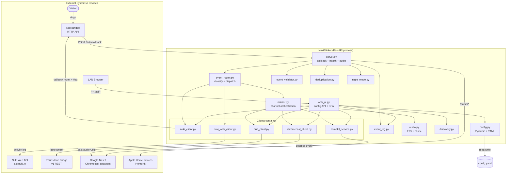
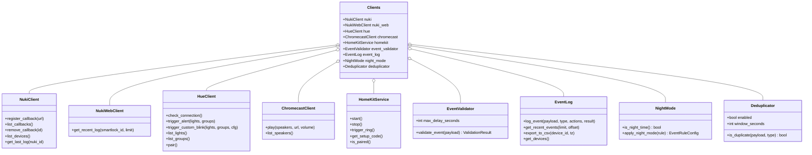
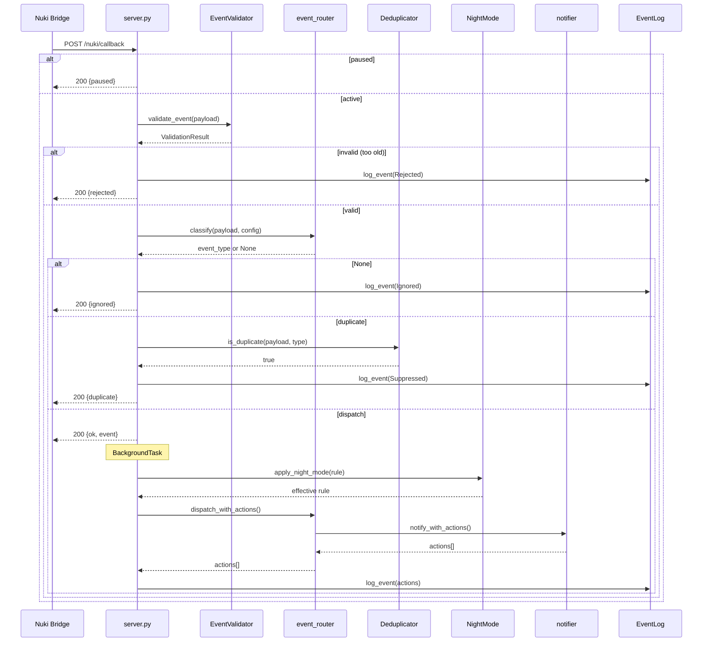
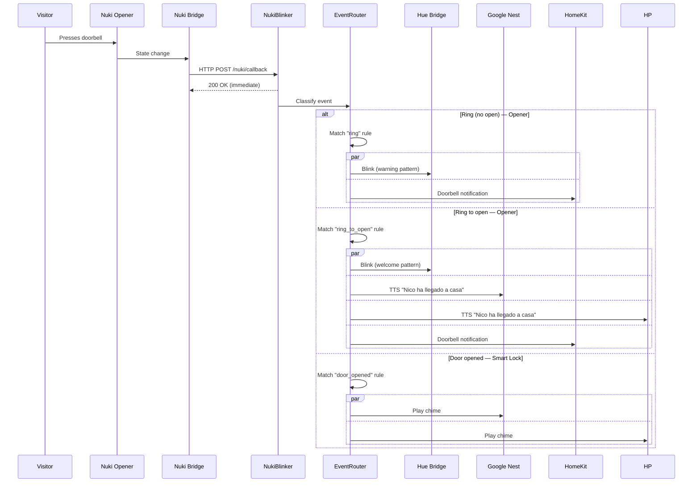
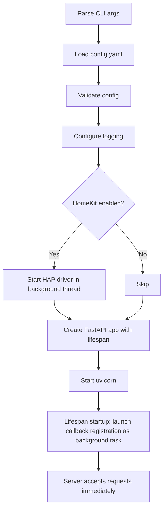
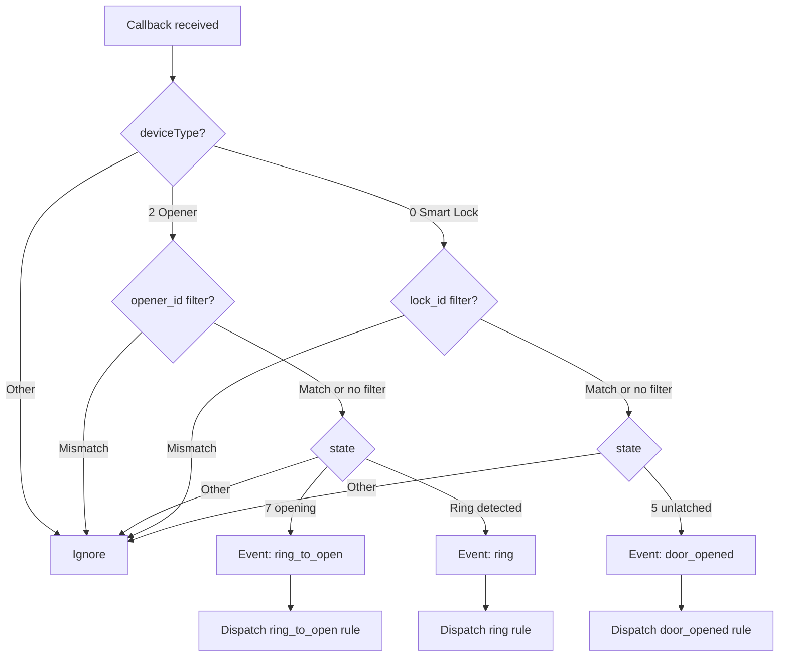
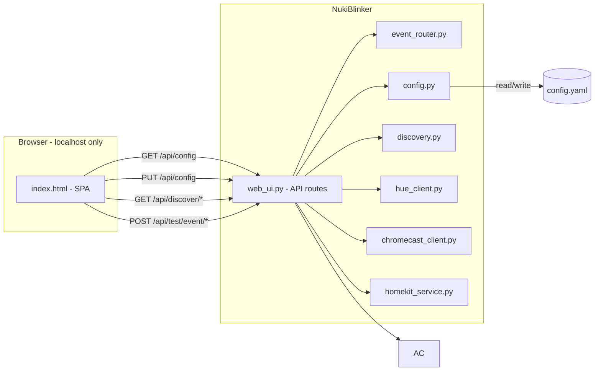
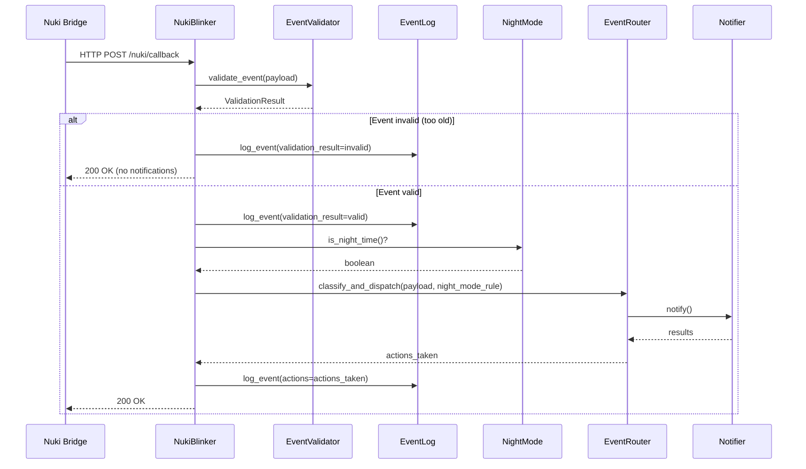

# Tech Spec — NukiBlinker

## Architecture Overview

```
nukiblinker/
├── __main__.py              # Entry point — loads config, starts server
├── config.py                # YAML config loading + Pydantic validation + save
├── server.py                # FastAPI app — callback endpoint + web UI API
├── web_ui.py                # Web configuration UI (serves static + API routes)
├── event_router.py          # Classifies Nuki events and dispatches to matching rule
├── nuki_client.py           # Nuki Bridge HTTP API client (callback registration)
├── hue_client.py            # Philips Hue Bridge API client (light control)
├── chromecast_client.py     # Google Nest / Chromecast audio playback
├── audio.py                 # Audio generation (TTS + chime selection)
├── homekit_service.py       # Apple HomeKit doorbell accessory (HAP-python)
├── discovery.py             # Auto-discovery for Nuki, Hue, Chromecast
├── notifier.py              # Orchestrates notification channels per event rule
├── logging_config.py        # Structured logging setup
├── sounds/                  # Bundled chime audio files
│   └── chime.wav              # Default doorbell chime (generated at Docker build)
└── static/                  # Web UI frontend (HTML, CSS, JS)
    └── index.html
```

## Architecture Diagrams

### Component Diagram

External devices/services and the internal modules that talk to them. `server.py`
handles the inbound Nuki callback pipeline; `web_ui.py` serves the SPA and config
API; the per-integration clients live in the `Clients` container.



### Class Diagram — Clients & Services

The `Clients` dataclass (`__main__.py`) is a lazy container instantiated by
`_build_clients()`. Each attribute is populated only when the relevant config is
present (e.g. `hue` is `None` until a Hue bridge IP + key are configured). The
processing services (`EventValidator`, `EventLog`, `NightMode`, `Deduplicator`)
are always created.



### Callback Processing Pipeline

End-to-end interaction for an inbound Nuki callback as implemented in
`server.py`. The Bridge always gets a fast 200; actual notification dispatch
runs in a FastAPI `BackgroundTask` so the response is never blocked.



## Runtime

- **Python >= 3.11** (Docker image: `python:3.14-slim`)
- **Poetry** for dependency management
- **Docker** for deployment on Mini PC (WSL2), port mapping for LAN access

### Dependencies

| Package | Purpose |
|---|---|
| `fastapi` | HTTP server (callback + web UI API) |
| `uvicorn[standard]` | ASGI server |
| `httpx` | Async HTTP client (Nuki + Hue bridge APIs) |
| `pyyaml` | Config file parsing |
| `pydantic` | Config validation |
| `pychromecast` | Google Nest / Chromecast discovery + casting |
| `gTTS` | Text-to-speech audio generation |
| `HAP-python[QRCode]` | HomeKit accessory protocol |
| `zeroconf` | mDNS for bridge/speaker auto-discovery |

Dev: `black`, `flake8`, `pytest`, `pytest-asyncio`, `pytest-cov`, `httpx` (for `TestClient`).

## Execution Environment

- **Target**: Mini PC running Windows with WSL2/Docker.
- **Network**: Host networking (`network_mode: host`). Container shares the host's network stack directly. Required for mDNS/multicast (speaker discovery, HomeKit advertising). On WSL2, mirrored networking mode is recommended for full LAN multicast support.
- **Persistence**: `config.yaml` is read-write (web UI saves to it). Mounted as a volume. Save operations include read-back verification to detect silent write failures.
- **Startup diagnostics**: Logs a config summary at startup showing which integrations are configured (e.g., `nuki=192.168.1.100, hue=<not configured>`).

### Development Environments

| Environment | Role |
|---|---|
| Work laptop (Windows) | Code only. No testing, no Poetry, no Docker. |
| Personal Mac | `make test` + `make lint` (unit tests, mocked). `make runLocal` for real-device testing. |
| GitHub Actions | CI: lint → test. |
| Mini PC (Windows + WSL2) | Production: `git pull && docker compose build && up -d`. |

### Testing on Mac

- **`make test`** — Unit/integration tests with mocked HTTP. No real devices needed.
- **`make runLocal`** — Real-device testing. Direct LAN access, mDNS works, HomeKit advertising works. Best for end-to-end validation.
- **`make build`** — Verify Docker image builds. Use `make runLocal` for real-device testing.

## Event Flow



## Component Design

### Config (`config.py`)

Pydantic models validate the YAML config. Supports both load and save (web UI writes back).

```python
class NukiConfig(BaseModel):
    bridge_ip: str = ""
    bridge_port: int = 8080
    api_token: str = ""
    opener_id: int | None = None   # filter Opener events by nukiId
    lock_id: int | None = None     # filter Smart Lock events by nukiId

class HueConfig(BaseModel):
    bridge_ip: str = ""
    api_key: str = ""
    lights: list[int] = []
    groups: list[int] = []

class CustomBlinkConfig(BaseModel):
    hue: int = 0                  # 0-65535
    saturation: int = 254         # 0-254
    brightness: int = 254         # 1-254
    flashes: int = 3
    interval_ms: int = 500

class BlinkConfig(BaseModel):
    mode: str = "alert"           # "alert", "custom", or "none"
    custom: CustomBlinkConfig = CustomBlinkConfig()

class SpeakersConfig(BaseModel):
    chromecast: list[str] = []    # Google Nest / Chromecast speaker names
    volume: float = 0.5           # 0.0-1.0

class AudioConfig(BaseModel):
    enabled: bool = False
    mode: str = "tts"              # "tts", "chime", or "none"
    message: str = "{name} llegó a casa"  # template, supports {name}
    chime: str = "chime.wav"       # filename in sounds/ (when mode="chime")
    fallback_name: str = "Alguien" # used when {name} can't be resolved

class EventRuleConfig(BaseModel):
    blink: BlinkConfig = BlinkConfig()
    audio: AudioConfig = AudioConfig()
    homekit: bool = True

class EventRulesConfig(BaseModel):
    ring: EventRuleConfig = EventRuleConfig(
        blink=BlinkConfig(mode="alert"),
        audio=AudioConfig(enabled=False),
        homekit=True,
    )
    ring_to_open: EventRuleConfig = EventRuleConfig(
        blink=BlinkConfig(mode="custom"),
        audio=AudioConfig(enabled=True, mode="tts", message="Nico ha llegado a casa"),
        homekit=True,
    )
    door_opened: EventRuleConfig = EventRuleConfig(
        blink=BlinkConfig(mode="none"),
        audio=AudioConfig(enabled=True, mode="chime"),
        homekit=False,
    )

class HomeKitConfig(BaseModel):
    enabled: bool = False
    setup_code: str = ""          # auto-generated if empty
    persist_dir: str = ".homekit" # HAP-python state directory

class ServerConfig(BaseModel):
    host: str = "0.0.0.0"
    port: int = 8080
    public_host: str = ""         # LAN IP for externally-reachable URLs (callback + HAP + audio); auto-detected when empty

class AppConfig(BaseModel):
    nuki: NukiConfig = NukiConfig()
    hue: HueConfig = HueConfig()
    speakers: SpeakersConfig = SpeakersConfig()
    homekit: HomeKitConfig = HomeKitConfig()
    events: EventRulesConfig = EventRulesConfig()
    server: ServerConfig = ServerConfig()
```

All fields have defaults → the service can start with an empty/missing `config.yaml` and be configured entirely via the web UI.

### Server (`server.py`)

FastAPI app:

- **`POST /nuki/callback`** — Receives Nuki Bridge callback payloads.
  - Accepts `deviceType == 0` (Smart Lock) and `deviceType == 2` (Opener).
  - Optionally filters by `nukiId` using `opener_id` or `lock_id`.
  - Passes payload to `event_router.classify()` to determine event type.
  - Dispatches to the matching event rule's notification channels.
  - Returns 200 immediately (Nuki Bridge expects fast response).

- **`GET /health`** — Health check endpoint.

- **Web UI routes** — Mounted from `web_ui.py` (see below).

### Web UI (`web_ui.py`)

Serves the configuration page and provides API endpoints for it.

**Access control middleware** (`PrivateNetworkMiddleware`): Uses `ipaddress.ip_address(client_ip).is_private` to allow requests from localhost, Docker gateway (172.x), and LAN IPs. Returns `403 Forbidden` for public IPs.

**API routes** (all under `/api/`):

| Method | Endpoint | Purpose |
|---|---|---|
| GET | `/api/config` | Return current config (secrets masked) |
| PUT | `/api/config` | Save updated config → `config.yaml` |
| GET | `/api/discover/nuki` | Auto-discover Nuki Bridges |
| GET | `/api/discover/hue` | Auto-discover Hue Bridges |
| GET | `/api/discover/speakers` | Auto-discover Chromecast speakers |
| POST | `/api/nuki/pair` | Register callback on Nuki Bridge |
| GET | `/api/nuki/devices` | List Nuki devices (Openers + Smart Locks) |
| GET | `/api/nuki/callbacks` | List registered callbacks on Bridge |
| GET | `/api/hue/status` | Check Hue Bridge connection and API key validity |
| POST | `/api/hue/pair` | Pair with Hue Bridge (validates existing key first) |
| GET | `/api/hue/lights` | List available Hue lights |
| GET | `/api/hue/groups` | List available Hue groups |
| GET | `/api/homekit/qr` | HomeKit setup code, pairing status & QR (SVG) |
| POST | `/api/test/event/{type}` | Fire all channels for a specific event rule |
| GET | `/api/status` | Service status, last event |
| POST | `/api/pause` | Deregister Nuki callback (keep service running) |
| POST | `/api/resume` | Re-register Nuki callback |

**Static files**: `index.html` — single-page app (vanilla JS or lightweight framework). Served at `/`.

### Nuki Client (`nuki_client.py`)

Manages the Nuki Bridge HTTP API:

- **`register_callback(callback_url)`** — `GET /callback/add?url=<url>&token=<token>`.
  - Lists existing callbacks first to avoid duplicates.
- **`list_callbacks()`** — Returns current registered callbacks.
- **`remove_callback(callback_id)`** — Removes a callback by ID.
- **`list_devices()`** — Returns paired devices (Openers + Smart Locks, for the web UI picker).
- **`get_last_log(nuki_id, count=1)`** — `GET /log?nukiId=<id>&count=1&token=<token>`. Returns the latest activity log entry, including the `name` of the user who triggered the action.

### Hue Client (`hue_client.py`)

Manages the Philips Hue Bridge v1 REST API:

- **`check_connection()`** — Validates API key by reading bridge config (`GET /api/{key}/config`). Returns `{connected, name, error}`.
- **`trigger_alert(light_ids, group_ids)`** — Sends `{"alert": "lselect"}`.
- **`get_light_state(light_id)`** — Reads current state.
- **`set_light_state(light_id, state)`** — Sets light to a specific state.
- **`trigger_custom_blink(light_ids, config)`** — Save → flash loop → restore.
- **`list_lights()`** — Returns all lights (for web UI picker).
- **`list_groups()`** — Returns all groups (for web UI picker).
- **`pair()`** — Creates API key via `POST /api {"devicetype":"nukiblinker"}`.

Uses `httpx.AsyncClient` for non-blocking HTTP calls.

### Audio (`audio.py`)

Generates or selects audio files for playback:

- **`render_message(template, context)`** — Replaces `{name}` (and future variables) in the template. Falls back to `fallback_name` if `name` is not available.
- **`get_audio(audio_config: AudioConfig, context: dict) -> Path`** — Returns path to an audio file:
  - `mode="tts"`: renders template → generates an `.mp3` via `gTTS`, caches by rendered message hash.
  - `mode="chime"`: returns `sounds/{chime_filename}` (default `chime.wav`).
- TTS cache is in-memory (same rendered message doesn’t regenerate).
- The default `chime.wav` is generated at Docker build time by `script/generate_chime.py` (pure-stdlib, no committed binary); the `sounds/` dir ships only a `.gitkeep` in git.

### Chromecast Client (`chromecast_client.py`)

Manages Google Nest / Chromecast speakers:

- **`play(speaker_names, audio_path, volume)`** — For each speaker:
  1. Connect via `pychromecast`.
  2. Set volume → cast audio → restore volume.
- **`list_speakers()`** — Discover Chromecast devices on LAN.

> **Note**: Apple HomePod / AirPlay output (`airplay_client.py`, `pyatv`) was removed in v0.4.x — HomePod RTSP `SETUP` timed out unreliably and HomePod owners are still notified via the HomeKit doorbell. Chromecast is now the only audio output.

### HomeKit Service (`homekit_service.py`)

Exposes a virtual HomeKit doorbell accessory:

- Uses `HAP-python` to create a `Doorbell` accessory with category `CATEGORY_SENSOR` — **not** `CATEGORY_VIDEO_DOOR_BELL`, since iOS refuses to pair a video doorbell that lacks a camera RTP stream service (same pattern as Homebridge doorbell plugins without camera).
- The accessory exposes two services: `Doorbell` (primary; push notification on ring) and `StatelessProgrammableSwitch` (programmable button — bare Doorbell events cannot trigger Home app automations, the switch can). The switch carries `ServiceLabelIndex=1` to disambiguate the two `ProgrammableSwitchEvent` services — without it, iOS accepts pairing but rejects the attribute database and silently drops the accessory. `trigger_ring()` fires `ProgrammableSwitchEvent` (single press) on both.
- The HAP driver binds and advertises on the LAN address resolved by `get_public_host()` (`server.public_host` config, or auto-detect) — the same IP used for the Nuki callback URL. On multi-interface hosts (WSL2/Docker), zeroconf auto-selection may advertise an unreachable internal IP, which makes discovery or pairing fail.
- **`start()`** — Starts the HAP accessory driver (runs in a background thread).
- **`trigger_ring()`** — Fires `ProgrammableSwitchEvent` on both services → paired Apple devices receive a notification and Home app automations bound to the button fire.
- **`get_setup_code()`** — Returns the 8-digit setup code for pairing. When not set in config, the generated code is persisted to `{persist_dir}/setup_code` and reused on every restart (HAP-python stores the pincode in `accessory.state`, so the code must be stable). Generated codes skip the trivial codes Apple rejects (`000-00-000` … `999-99-999`, `123-45-678`, `876-54-321`).
- **`get_qr_code()`** — Returns QR code data (base64 PNG) for the web UI.
- **`is_paired()`** — Whether any Apple device has paired.

State (pairing keys) persisted in `config.homekit.persist_dir`.

### Discovery (`discovery.py`)

Auto-discovery for devices on the LAN:

```python
async def discover_nuki_bridges() -> list[dict]:
    """Nuki Cloud endpoint or local UDP broadcast."""

async def discover_hue_bridges() -> list[dict]:
    """mDNS (_hue._tcp.local) or discovery.meethue.com."""

async def discover_chromecast_speakers() -> list[dict]:
    """pychromecast / zeroconf scan."""
```

Each returns a list of `{"name": ..., "ip": ..., "port": ..., "type": "chromecast"}`.

### Event Router (`event_router.py`)

Classifies Nuki callback payloads into event types and dispatches to the matching rule:

```python
def classify(payload: dict) -> str | None:
    """Returns 'ring', 'ring_to_open', or 'door_opened'. None if ignored."""
    device_type = payload.get("deviceType")
    state = payload.get("state")

    if device_type == 2:     # Opener
        # state=7 → ring_to_open; ring without opening → ring
        ...
    elif device_type == 0:   # Smart Lock
        # state=5 (unlatched) → door_opened (state=3 unlocked is ignored — #60)
        ...
    return None              # unknown device type

async def resolve_person(payload: dict, nuki_client) -> dict:
    """Query Nuki Bridge /log to get the user name for the event.
    Returns context dict: {"name": "Nico"} or {"name": fallback}."""
    nuki_id = payload.get("nukiId")
    try:
        log = await nuki_client.get_last_log(nuki_id)
        return {"name": log.get("name", config.fallback_name)}
    except Exception:
        return {"name": config.fallback_name}

async def dispatch(event_type: str, payload: dict, config: AppConfig, clients: Clients):
    """Looks up config.events[event_type], resolves person, fires channels."""
    rule = getattr(config.events, event_type)
    context = {}
    if event_type in ("ring_to_open", "door_opened"):
        context = await resolve_person(payload, clients.nuki)
    await notifier.notify(rule, config, clients, context)
```

### Notifier (`notifier.py`)

Orchestrates notification channels for a given event rule:

```python
async def notify(rule: EventRuleConfig, config: AppConfig, clients: Clients, context: dict = None):
    tasks = []

    # Hue lights (per-event blink pattern)
    if rule.blink.mode != "none" and (config.hue.lights or config.hue.groups):
        tasks.append(trigger_hue(clients.hue, config.hue, rule.blink))

    # Audio (chime or TTS, per-event, with {name} template)
    if rule.audio.enabled and rule.audio.mode != "none":
        audio_path = audio.get_audio(rule.audio, context or {})
        if config.speakers.chromecast:
            tasks.append(trigger_chromecast(
                clients.chromecast, config.speakers.chromecast,
                audio_path, config.speakers.volume
            ))

    # HomeKit doorbell notification
    if rule.homekit and config.homekit.enabled:
        tasks.append(trigger_homekit(clients.homekit))

    results = await asyncio.gather(*tasks, return_exceptions=True)
    for r in results:
        if isinstance(r, Exception):
            logger.warning("Notification channel failed: %s", r)
```

### Entry Point (`__main__.py`)



1. Parse CLI args (`--config config.yaml`).
2. Load and validate config (defaults allow empty config).
3. Configure logging.
4. If HomeKit enabled: start HAP accessory driver in a background thread.
5. Create FastAPI app with `lifespan` context manager.
6. Start uvicorn — server is ready immediately.
7. Lifespan startup launches Nuki callback registration as `asyncio.create_task` (non-blocking, with infinite retry: 10s → 20s → 40s → 60s).

### Shutdown (Lifespan teardown)

Handled by the `lifespan` context manager's teardown phase:

```python
@asynccontextmanager
async def lifespan(app):
    # startup
    app.state.callback_id = None
    registration_task = asyncio.create_task(
        _register_callback_loop(config, clients, app)
    )
    yield
    # shutdown
    registration_task.cancel()
    with contextlib.suppress(asyncio.CancelledError):
        await registration_task
    await _deregister_callback(clients, app.state.callback_id)
    if clients.homekit is not None:
        clients.homekit.stop()
```

On shutdown: cancels the registration retry task (if still running), deregisters the callback from the Nuki Bridge, and stops HomeKit. If the Bridge is unreachable, deregistration is logged as a warning but does not block exit.

## Nuki Bridge Callback Payload

```json
{
    "nukiId": 12345,
    "deviceType": 2,
    "mode": 2,
    "state": 7,
    "stateName": "opening",
    "batteryCritical": false
}
```

Key fields:
- `deviceType`: 0=SmartLock, 2=Opener

**Opener states** (deviceType=2):
  - `1` = online (routine status update — **NOT** a ring; must be ignored)
  - `3` = rto active
  - `5` = open
  - `7` = opening (door being opened → event: **ring_to_open**)

**Opener ring detection**: A ring is signalled by the callback fields `ringactionState: true` / `ringactionTimestamp` (the ring-action flag, reset after 30 s — Bridge API §4.x), independent of `state`. Classification: `ringactionState == true` → **ring**; `state == 7` → **ring_to_open**. The old `state == 1 → ring` rule was incorrect (it fired on every "online" status callback) and was removed (#97).

**Smart Lock states** (deviceType=0):
  - `1` = locked
  - `3` = unlocked → ignored (unlocking without opening must not notify — #60)
  - `5` = unlatched → event: **door_opened**
  - `7` = unlatched (lock’n’go)

### Event Classification Logic



Note: The exact state values will be confirmed during implementation against the Nuki Bridge HTTP API v1.13 documentation.

## External API Reference

### Hue Bridge v1 REST

| Method | Endpoint | Purpose |
|---|---|---|
| POST | `/api` | Create API key (pairing) |
| GET | `/api/{key}/lights` | List all lights |
| GET | `/api/{key}/lights/{id}` | Read light state |
| PUT | `/api/{key}/lights/{id}/state` | Set light state |
| GET | `/api/{key}/groups` | List all groups |
| PUT | `/api/{key}/groups/{id}/action` | Set group action |

### Nuki Bridge HTTP API

| Method | Endpoint | Purpose |
|---|---|---|
| GET | `/list` | List paired devices |
| GET | `/callback/list` | List registered callbacks |
| GET | `/callback/add?url=&token=` | Register callback |
| GET | `/callback/remove?id=` | Remove callback |
| GET | `/log?nukiId=&count=&token=` | Activity log (includes user name) |

### Chromecast Protocol

Via `pychromecast` — no direct HTTP. Library handles mDNS discovery, connection, and media casting.

### HomeKit Accessory Protocol

Via `HAP-python` — no direct HTTP. Library handles mDNS advertising, pairing, and event dispatch.

## Web UI Architecture



The frontend is a single `index.html` with embedded CSS/JS (no build step, no npm). Communicates with the backend via JSON API calls.

## CI/CD

- **GitHub Actions** (`.github/workflows/ci.yml`):
  - On push/PR: lint (flake8) + test (pytest).
- **Dependabot** (`.github/dependabot.yml`): auto-updates for pip, GitHub Actions, and Docker.
- **Local build**: Docker image is built on the Mini PC via `docker compose build`. No registry involved.

## Testing

All tests run via `make test` on the Mac. Real-device testing via `make runLocal`.

| Test file | Covers |
|---|---|
| `tests/test_config.py` | Config validation, load, save, defaults |
| `tests/test_server.py` | Callback endpoint (valid events, wrong device, unknown state) |
| `tests/test_event_router.py` | Event classification, person resolution (mock /log), rule dispatch |
| `tests/test_audio.py` | TTS generation, {name} template rendering, chime file resolution |
| `tests/test_web_ui.py` | Web UI API routes + localhost access control (403) |
| `tests/test_hue_client.py` | Hue API calls (mock httpx) |
| `tests/test_nuki_client.py` | Callback registration (mock httpx) |
| `tests/test_chromecast.py` | Chromecast audio playback (mock pychromecast) |
| `tests/test_homekit.py` | HAP accessory lifecycle (mock HAP-python) |
| `tests/test_notifier.py` | Per-event rule channel dispatch, failure isolation |
| `tests/test_discovery.py` | Auto-discovery responses (mock zeroconf/pychromecast) |
| `tests/test_lifecycle.py` | Startup registration, graceful shutdown deregistration, pause/resume |
| `tests/test_nuki_web_client.py` | Nuki Web API activity-log client (mock httpx) |
| `tests/test_event_validator.py` | Event timestamp validation (delay threshold, missing/future timestamps) |
| `tests/test_event_log.py` | Event logging, retention, device filtering, CSV export (BOM, tz, Date/Time) |
| `tests/test_night_mode.py` | Night-mode window detection, rule adjustment (audio off, dimmed lights) |
| `tests/test_deduplication.py` | Duplicate suppression window and key discrimination |
| `tests/test_new_services_extra.py` | Extra edge cases for validator / log / night mode |
| `tests/test_web_ui_new_endpoints.py` | Event log, devices, export, and per-feature config endpoints |
| `tests/test_integration_event_pipeline.py` | End-to-end callback pipeline (validate → classify → dedup → dispatch → log) |

## Docker

```dockerfile
FROM python:3.14-slim
# Poetry install → copy source → generate chime.wav → EXPOSE 8080 → ENTRYPOINT
```

### Production deployment (Mini PC)

```yaml
services:
  nukiblinker:
    build: .
    network_mode: host
    restart: unless-stopped
    volumes:
      - ./config.yaml:/app/config.yaml       # read-write for web UI
      - ./homekit:/app/.homekit               # HomeKit pairing state
```

> **Note**: `network_mode: host` is required for mDNS-based speaker discovery and HomeKit. Port 8080 is exposed directly on the host (no port mapping needed). On WSL2, enable mirrored networking for full multicast support.

Deploy/update:

```sh
docker compose build && docker compose up -d
```

### Local testing (Mac)

```sh
make runLocal    # best for real-device testing (direct LAN + mDNS)
make build       # verify Docker image builds
```

## New Features (v0.3.0)

### Event Validation Service (`event_validator.py`)

Validates event timestamps before processing:

```python
class EventValidator:
    def __init__(self, max_delay_seconds: int = 60):
        self.max_delay_seconds = max_delay_seconds
    
    def validate_event(self, payload: dict) -> ValidationResult:
        """Check if event timestamp is within acceptable delay."""
        event_time = self._extract_timestamp(payload)
        now = datetime.now(timezone.utc)
        delay = (now - event_time).total_seconds()
        
        return ValidationResult(
            valid=delay <= self.max_delay_seconds,
            delay_seconds=delay,
            reason="Event too old" if delay > self.max_delay_seconds else None
        )
```

### Event Log Service (`event_log.py`)

Persistent event logging with web UI access:

```python
class EventLog:
    def __init__(self, max_entries: int = 1000, retention_days: int = 7):
        self.entries: list[EventLogEntry] = []
        self.max_entries = max_entries
        self.retention_days = retention_days
    
    def log_event(self, payload: dict, event_type: str, actions: list[str], validation_result: ValidationResult):
        """Add event to log with full context."""
        entry = EventLogEntry(
            timestamp=datetime.now(timezone.utc),
            event_type=event_type,
            payload=payload,
            actions=actions,
            validation_result=validation_result
        )
        self.entries.append(entry)
        self._cleanup_old_entries()
    
    def get_recent_events(self, limit: int = 100) -> list[EventLogEntry]:
        """Return recent events for web UI."""
        return self.entries[-limit:]
```

### Night Mode Service (`night_mode.py`)

Manages time-based notification behavior:

```python
class NightMode:
    def __init__(self, start_time: str = "22:00", end_time: str = "07:00", brightness_factor: float = 0.3):
        self.start_time = start_time
        self.end_time = end_time
        self.brightness_factor = brightness_factor
    
    def is_night_time(self) -> bool:
        """Check if current time is within night mode hours."""
        now = datetime.now().time()
        start = datetime.strptime(self.start_time, "%H:%M").time()
        end = datetime.strptime(self.end_time, "%H:%M").time()
        
        if start <= end:
            return start <= now <= end
        else:  # Overnight (e.g., 22:00 to 07:00)
            return now >= start or now <= end
    
    def apply_night_mode(self, rule: EventRuleConfig) -> EventRuleConfig:
        """Return modified rule for night mode."""
        if not self.is_night_time():
            return rule
        
        night_rule = rule.copy(deep=True)
        night_rule.audio.enabled = False  # Disable audio
        
        # Reduce light brightness for custom blink
        if night_rule.blink.mode == "custom":
            night_rule.blink.custom.brightness = int(
                night_rule.blink.custom.brightness * self.brightness_factor
            )
        
        return night_rule
```

### Updated Config Models

Extended Pydantic models for new features:

```python
class EventValidationConfig(BaseModel):
    enabled: bool = True
    max_delay_seconds: int = 60  # Reject events older than 60 seconds

class NightModeConfig(BaseModel):
    enabled: bool = False
    start_time: str = "22:00"    # 10 PM
    end_time: str = "07:00"      # 7 AM
    brightness_factor: float = 0.3  # 30% of normal brightness
    grace_minutes: int = 5       # 5-minute buffer

class EventLogConfig(BaseModel):
    enabled: bool = True
    max_entries: int = 1000
    retention_days: int = 7
    persist_to_file: bool = True
    file_path: str = "logs/event_log.json"

class AppConfig(BaseModel):
    # ... existing fields ...
    event_validation: EventValidationConfig = EventValidationConfig()
    night_mode: NightModeConfig = NightModeConfig()
    event_log: EventLogConfig = EventLogConfig()
```

### Updated Web UI API Routes

New endpoints in `web_ui.py`:

| Method | Endpoint | Purpose |
|---|---|---|
| GET | `/api/events/log` | Get recent event log entries |
| GET | `/api/events/export` | Download event log as CSV |
| POST | `/api/events/clear` | Clear event log |
| PUT | `/api/config/event-validation` | Update validation settings |
| PUT | `/api/config/night-mode` | Update night mode settings |
| PUT | `/api/config/event-log` | Update event log settings |

### Updated Event Flow



## New Features (v0.4.0)

### Event Deduplication (`deduplication.py`) (#97)

```python
class Deduplicator:
    def __init__(self, window_seconds: int = 120, enabled: bool = True):
        self.window_seconds = window_seconds
        self.enabled = enabled
        self._recent: dict[tuple, float] = {}  # key -> monotonic ts

    def is_duplicate(self, payload: dict, event_type: str) -> bool:
        """True if an equivalent event was seen within window_seconds.

        Key = (nukiId, event_type, discriminator), where discriminator is
        ringactionTimestamp for 'ring' (so a genuine second ring with a new
        timestamp is NOT a duplicate) and the lock `state` otherwise.
        Records the event and prunes expired keys on every call.
        """
```

Wired into `server.py` after classification: a duplicate is logged to the Event Log with action `"Suppressed: duplicate within {window}s"` and no notification fires.

### Nuki Web API Client (`nuki_web_client.py`) — optional name/trigger resolution

When `nuki.web_api_token` is set, `resolve_person()` prefers the Nuki Web API activity log over the local bridge `/log`:

```python
class NukiWebClient:
    BASE = "https://api.nuki.io"
    def __init__(self, api_token: str): ...
    async def get_recent_log(self, smartlock_id: int | None = None, limit: int = 20) -> list[dict]:
        """GET /smartlock/log (Bearer token). Returns entries with name, action, trigger, source, date."""
```

- Uses `httpx` (no new dependency).
- `resolve_person()` returns `{"name": ..., "trigger": ...}`; the bridge `/log` remains the fallback when the Web API is not configured or returns nothing.
- The bridge cannot identify an anonymous visitor; the Web API is the only source for `name`/`trigger`/`source`.

### Event Log CSV export (#96)

`EventLog.export_to_csv(device_id: int | None = None, tz: str = "Europe/Madrid")`:

- Output starts with a UTF-8 BOM (`\ufeff`) and an Excel `sep=,` hint line so Excel (incl. Spanish locale) splits columns and renders accents.
- The UTC `Timestamp` column is replaced by **`Date`** (`YYYY-MM-DD`) and **`Time`** (`HH:MM:SS`) in the configured timezone via `zoneinfo.ZoneInfo`.
- `device_id` filters rows to a single `nukiId`.

`EventLog.get_recent_events(limit, offset, device_id=None)` and a new `EventLog.get_devices()` (distinct `nukiId`/`deviceType`/name seen) back the Web UI device filter. New endpoints: `GET /api/events/devices`; `GET /api/events/log?device_id=`; `GET /api/events/export?device_id=`.

### Updated config models (v0.4.0)

```python
class NukiConfig(BaseModel):
    # ... existing ...
    web_api_token: str = ""          # optional Nuki Web API token (name/trigger resolution)

class DeduplicationConfig(BaseModel):
    enabled: bool = True
    window_seconds: int = 120

class EventLogConfig(BaseModel):
    # ... existing ...
    timezone: str = "Europe/Madrid"  # IANA tz for CSV Date/Time columns

class AppConfig(BaseModel):
    # ... existing ...
    deduplication: DeduplicationConfig = DeduplicationConfig()
```

## Logging

- Structured logging via Python `logging` module.
- Console output (INFO level by default).
- Rotating file log (`logs/nukiblinker.log`), configurable retention.
- Event log service: separate structured log for event processing (JSON format).
- Key events logged: startup, callback received, event classified (ring / ring_to_open), rule dispatched, channel triggered, channel failure, config saved.
- Event validation warnings when events are rejected due to age.
- Night mode activation/deactivation logs.
