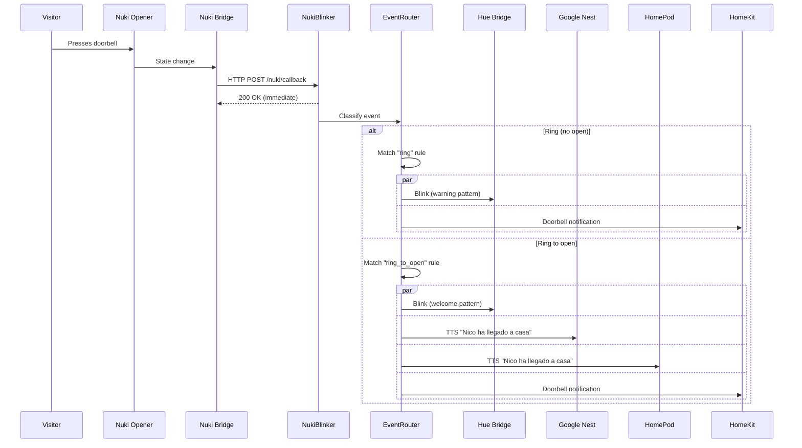
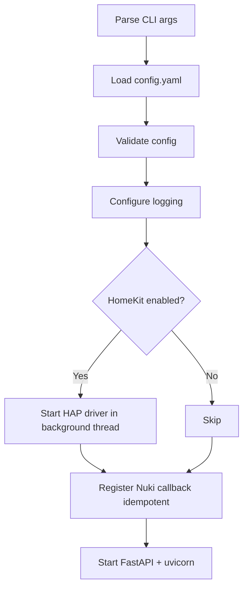
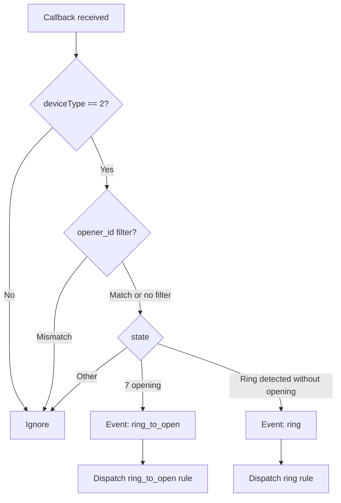
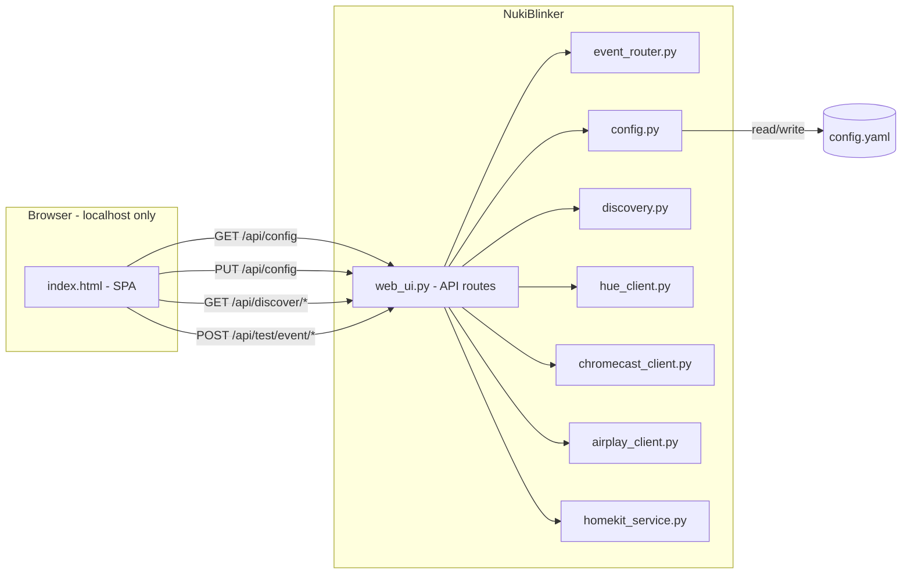

# Tech Spec — NukiBlinker

## Architecture Overview

```
nukiblinker/
├── __main__.py              # Entry point — loads config, starts server
├── config.py                # YAML config loading + Pydantic validation + save
├── server.py                # FastAPI app — callback endpoint + web UI API
├── web_ui.py                # Web configuration UI (serves static + API routes)
├── event_router.py          # Classifies Nuki events and dispatches to matching rule
├── nuki_client.py           # Nuki Bridge HTTP API client (callback registration)
├── hue_client.py            # Philips Hue Bridge API client (light control)
├── chromecast_client.py     # Google Nest / Chromecast TTS announcements
├── airplay_client.py        # Apple HomePod AirPlay 2 TTS announcements
├── homekit_service.py       # Apple HomeKit doorbell accessory (HAP-python)
├── discovery.py             # Auto-discovery for Nuki, Hue, Chromecast, AirPlay
├── notifier.py              # Orchestrates notification channels per event rule
├── logging_config.py        # Structured logging setup
└── static/                  # Web UI frontend (HTML, CSS, JS)
    └── index.html
```

## Runtime

- **Python >= 3.11** (Docker image: `python:3.14.5-slim`)
- **Poetry** for dependency management
- **Docker** for deployment on Mini PC (WSL2), `--network host` for LAN access

### Dependencies

| Package | Purpose |
|---|---|
| `fastapi` | HTTP server (callback + web UI API) |
| `uvicorn[standard]` | ASGI server |
| `httpx` | Async HTTP client (Nuki + Hue bridge APIs) |
| `pyyaml` | Config file parsing |
| `pydantic` | Config validation |
| `pychromecast` | Google Nest / Chromecast discovery + casting |
| `pyatv` | Apple HomePod / AirPlay 2 discovery + streaming |
| `gTTS` | Text-to-speech audio generation |
| `HAP-python[QRCode]` | HomeKit accessory protocol |
| `zeroconf` | mDNS for bridge/speaker auto-discovery |

Dev: `black`, `flake8`, `pytest`, `pytest-asyncio`, `pytest-cov`, `httpx` (for `TestClient`).

## Execution Environment

- **Target**: Mini PC running Windows with WSL2/Docker.
- **Network**: `--network host` mode so the container shares the host's LAN IP.
- **Persistence**: `config.yaml` is read-write (web UI saves to it). Mounted as a volume.

### Development Environments

| Environment | Role |
|---|---|
| Work laptop (Windows) | Code only. No testing, no Poetry, no Docker. |
| Personal Mac | `make test` + `make lint` (unit tests, mocked). `make runLocal` for real-device testing. |
| GitHub Actions | CI/CD: lint → test → build Docker → push to GHCR. |
| Mini PC (Windows + WSL2) | Production: `docker compose pull && up -d`. |

### Testing on Mac

- **`make test`** — Unit/integration tests with mocked HTTP. No real devices needed.
- **`make runLocal`** — Real-device testing. Direct LAN access, mDNS works, HomeKit advertising works. Best for end-to-end validation.
- **`make build`** — Verify Docker image builds. Note: `--network host` doesn't work on Docker for Mac (runs in a Linux VM), so use `make runLocal` for device testing.

## Event Flow



## Component Design

### Config (`config.py`)

Pydantic models validate the YAML config. Supports both load and save (web UI writes back).

```python
class NukiConfig(BaseModel):
    bridge_ip: str = ""
    bridge_port: int = 8080
    api_token: str = ""
    opener_id: int | None = None

class HueConfig(BaseModel):
    bridge_ip: str = ""
    api_key: str = ""
    lights: list[int] = []
    groups: list[int] = []

class CustomBlinkConfig(BaseModel):
    hue: int = 0                  # 0-65535
    saturation: int = 254         # 0-254
    brightness: int = 254         # 1-254
    flashes: int = 3
    interval_ms: int = 500

class BlinkConfig(BaseModel):
    mode: str = "alert"           # "alert", "custom", or "none"
    custom: CustomBlinkConfig = CustomBlinkConfig()

class SpeakersConfig(BaseModel):
    chromecast: list[str] = []    # Google Nest / Chromecast speaker names
    airplay: list[str] = []       # HomePod / AirPlay speaker names
    volume: float = 0.5           # 0.0-1.0

class VoiceConfig(BaseModel):
    enabled: bool = False
    message: str = "Someone is at the door"

class EventRuleConfig(BaseModel):
    blink: BlinkConfig = BlinkConfig()
    voice: VoiceConfig = VoiceConfig()
    homekit: bool = True

class EventRulesConfig(BaseModel):
    ring: EventRuleConfig = EventRuleConfig(
        blink=BlinkConfig(mode="alert"),
        voice=VoiceConfig(enabled=False),
        homekit=True,
    )
    ring_to_open: EventRuleConfig = EventRuleConfig(
        blink=BlinkConfig(mode="custom"),
        voice=VoiceConfig(enabled=True, message="Nico ha llegado a casa"),
        homekit=True,
    )

class HomeKitConfig(BaseModel):
    enabled: bool = False
    setup_code: str = ""          # auto-generated if empty
    persist_dir: str = ".homekit" # HAP-python state directory

class ServerConfig(BaseModel):
    host: str = "0.0.0.0"
    port: int = 8080

class AppConfig(BaseModel):
    nuki: NukiConfig = NukiConfig()
    hue: HueConfig = HueConfig()
    speakers: SpeakersConfig = SpeakersConfig()
    homekit: HomeKitConfig = HomeKitConfig()
    events: EventRulesConfig = EventRulesConfig()
    server: ServerConfig = ServerConfig()
```

All fields have defaults → the service can start with an empty/missing `config.yaml` and be configured entirely via the web UI.

### Server (`server.py`)

FastAPI app:

- **`POST /nuki/callback`** — Receives Nuki Bridge callback payloads.
  - Validates `deviceType == 2` (Opener).
  - Optionally filters by `nukiId` if `opener_id` is configured.
  - Passes payload to `event_router.classify()` to determine event type.
  - Dispatches to the matching event rule's notification channels.
  - Returns 200 immediately (Nuki Bridge expects fast response).

- **`GET /health`** — Health check endpoint.

- **Web UI routes** — Mounted from `web_ui.py` (see below).

### Web UI (`web_ui.py`)

Serves the configuration page and provides API endpoints for it.

**Access control middleware**: Checks `request.client.host` against `127.0.0.1` / `::1`. Returns `403 Forbidden` for any other IP.

**API routes** (all under `/api/`):

| Method | Endpoint | Purpose |
|---|---|---|
| GET | `/api/config` | Return current config (secrets masked) |
| PUT | `/api/config` | Save updated config → `config.yaml` |
| GET | `/api/discover/nuki` | Auto-discover Nuki Bridges |
| GET | `/api/discover/hue` | Auto-discover Hue Bridges |
| GET | `/api/discover/speakers` | Auto-discover Chromecast + AirPlay speakers |
| GET | `/api/hue/lights` | List available Hue lights and groups |
| POST | `/api/hue/pair` | Initiate Hue Bridge pairing (press button flow) |
| POST | `/api/test/event/{type}` | Fire all channels for a specific event rule (ring or ring_to_open) |
| GET | `/api/status` | Bridge connectivity, last ring, uptime |
| GET | `/api/homekit/setup-code` | Return HomeKit pairing code + QR data |
| POST | `/api/pause` | Deregister Nuki callback (keep service running) |
| POST | `/api/resume` | Re-register Nuki callback |

**Static files**: `index.html` — single-page app (vanilla JS or lightweight framework). Served at `/`.

### Nuki Client (`nuki_client.py`)

Manages the Nuki Bridge HTTP API:

- **`register_callback(callback_url)`** — `GET /callback/add?url=<url>&token=<token>`.
  - Lists existing callbacks first to avoid duplicates.
- **`list_callbacks()`** — Returns current registered callbacks.
- **`remove_callback(callback_id)`** — Removes a callback by ID.
- **`list_openers()`** — Returns paired Openers (for the web UI picker).

### Hue Client (`hue_client.py`)

Manages the Philips Hue Bridge v1 REST API:

- **`trigger_alert(light_ids, group_ids)`** — Sends `{"alert": "lselect"}`.
- **`get_light_state(light_id)`** — Reads current state.
- **`set_light_state(light_id, state)`** — Sets light to a specific state.
- **`trigger_custom_blink(light_ids, config)`** — Save → flash loop → restore.
- **`list_lights()`** — Returns all lights (for web UI picker).
- **`list_groups()`** — Returns all groups (for web UI picker).
- **`pair()`** — Creates API key via `POST /api {"devicetype":"nukiblinker"}`.

Uses `httpx.AsyncClient` for non-blocking HTTP calls.

### Chromecast Client (`chromecast_client.py`)

Manages Google Nest / Chromecast speakers:

- **`announce(speaker_names, message, volume)`** — For each speaker:
  1. Generate TTS audio via `gTTS` → save as temp `.mp3`.
  2. Connect via `pychromecast`.
  3. Set volume → cast audio → restore volume.
- **`list_speakers()`** — Discover Chromecast devices on LAN via `pychromecast.get_chromecasts()`.

TTS audio is cached in memory (same message doesn't regenerate).

### AirPlay Client (`airplay_client.py`)

Manages Apple HomePod / AirPlay 2 speakers:

- **`announce(speaker_names, message, volume)`** — For each speaker:
  1. Generate TTS audio via `gTTS` → save as temp `.mp3`.
  2. Connect via `pyatv` (AirPlay 2).
  3. Stream audio → wait for completion.
- **`list_speakers()`** — Discover AirPlay devices on LAN via `pyatv.scan()`.

Shares the TTS cache with the Chromecast client (same `gTTS` output).

### HomeKit Service (`homekit_service.py`)

Exposes a virtual HomeKit doorbell accessory:

- Uses `HAP-python` to create a `Doorbell` accessory.
- **`start()`** — Starts the HAP accessory driver (runs in a background thread).
- **`trigger_ring()`** — Fires the doorbell `ProgrammableSwitchEvent` → all paired Apple devices receive a notification.
- **`get_setup_code()`** — Returns the 8-digit setup code for pairing.
- **`get_qr_code()`** — Returns QR code data (base64 PNG) for the web UI.
- **`is_paired()`** — Whether any Apple device has paired.

State (pairing keys) persisted in `config.homekit.persist_dir`.

### Discovery (`discovery.py`)

Auto-discovery for devices on the LAN:

```python
async def discover_nuki_bridges() -> list[dict]:
    """Nuki Cloud endpoint or local UDP broadcast."""

async def discover_hue_bridges() -> list[dict]:
    """mDNS (_hue._tcp.local) or discovery.meethue.com."""

async def discover_chromecast_speakers() -> list[dict]:
    """pychromecast / zeroconf scan."""

async def discover_airplay_speakers() -> list[dict]:
    """pyatv / zeroconf scan for AirPlay 2 devices."""
```

Each returns a list of `{"name": ..., "ip": ..., "port": ..., "type": "chromecast"|"airplay"}`.

### Event Router (`event_router.py`)

Classifies Nuki callback payloads into event types and dispatches to the matching rule:

```python
def classify(payload: dict) -> str:
    """Returns 'ring' or 'ring_to_open' based on Nuki Opener state."""
    # state=7 with RTO active → ring_to_open
    # ring detected without door opening → ring

async def dispatch(event_type: str, config: AppConfig, clients: Clients):
    """Looks up config.events[event_type] and fires matching channels."""
    rule = config.events.ring if event_type == "ring" else config.events.ring_to_open
    await notifier.notify(rule, config, clients)
```

### Notifier (`notifier.py`)

Orchestrates notification channels for a given event rule:

```python
async def notify(rule: EventRuleConfig, config: AppConfig, clients: Clients):
    tasks = []

    # Hue lights (per-event blink pattern)
    if rule.blink.mode != "none" and (config.hue.lights or config.hue.groups):
        tasks.append(trigger_hue(clients.hue, config.hue, rule.blink))

    # Voice announcements (per-event message)
    if rule.voice.enabled:
        if config.speakers.chromecast:
            tasks.append(trigger_chromecast(
                clients.chromecast, config.speakers.chromecast,
                rule.voice.message, config.speakers.volume
            ))
        if config.speakers.airplay:
            tasks.append(trigger_airplay(
                clients.airplay, config.speakers.airplay,
                rule.voice.message, config.speakers.volume
            ))

    # HomeKit doorbell notification
    if rule.homekit and config.homekit.enabled:
        tasks.append(trigger_homekit(clients.homekit))

    results = await asyncio.gather(*tasks, return_exceptions=True)
    for r in results:
        if isinstance(r, Exception):
            logger.warning("Notification channel failed: %s", r)
```

### Entry Point (`__main__.py`)



1. Parse CLI args (`--config config.yaml`).
2. Load and validate config (defaults allow empty config).
3. Configure logging.
4. If HomeKit enabled: start HAP accessory driver in a background thread.
5. Register callback on Nuki Bridge (idempotent). Skip if Nuki not configured yet.
6. Register shutdown hook (`SIGTERM` / `SIGINT`).
7. Start FastAPI/uvicorn server (callback endpoint + web UI).

### Shutdown Hook

Registered via FastAPI's `@app.on_event("shutdown")` or `signal.signal(SIGTERM, ...)`:

```python
async def shutdown():
    logger.info("Shutting down — deregistering Nuki callback")
    try:
        await nuki_client.remove_callback(registered_callback_id)
    except Exception as e:
        logger.warning("Failed to deregister callback: %s", e)
    if homekit_service:
        homekit_service.stop()
    logger.info("Clean shutdown complete")
```

If the Nuki Bridge is unreachable at shutdown time, the deregistration is logged as a warning but does not block exit. The stale callback is harmless (Bridge silently skips unreachable URLs) and will be reused on next startup.

## Nuki Bridge Callback Payload

```json
{
    "nukiId": 12345,
    "deviceType": 2,
    "mode": 2,
    "state": 7,
    "stateName": "opening",
    "batteryCritical": false
}
```

Key fields:
- `deviceType`: 0=SmartLock, 2=Opener
- `state`: Opener states relevant to NukiBlinker:
  - `1` = online (ring detected but door not opened → event type: **ring**)
  - `3` = rto active (Ring to Open mode enabled)
  - `5` = open
  - `7` = opening (door being opened → event type: **ring_to_open**)

### Event Classification Logic



Note: The exact state values for "ring without opening" will be confirmed during implementation against the Nuki Bridge HTTP API v1.13 documentation.

## External API Reference

### Hue Bridge v1 REST

| Method | Endpoint | Purpose |
|---|---|---|
| POST | `/api` | Create API key (pairing) |
| GET | `/api/{key}/lights` | List all lights |
| GET | `/api/{key}/lights/{id}` | Read light state |
| PUT | `/api/{key}/lights/{id}/state` | Set light state |
| GET | `/api/{key}/groups` | List all groups |
| PUT | `/api/{key}/groups/{id}/action` | Set group action |

### Nuki Bridge HTTP API

| Method | Endpoint | Purpose |
|---|---|---|
| GET | `/list` | List paired devices |
| GET | `/callback/list` | List registered callbacks |
| GET | `/callback/add?url=&token=` | Register callback |
| GET | `/callback/remove?id=` | Remove callback |

### Chromecast Protocol

Via `pychromecast` — no direct HTTP. Library handles mDNS discovery, connection, and media casting.

### AirPlay 2 Protocol

Via `pyatv` — no direct HTTP. Library handles mDNS discovery, pairing, and audio streaming to HomePod and AirPlay 2 speakers.

### HomeKit Accessory Protocol

Via `HAP-python` — no direct HTTP. Library handles mDNS advertising, pairing, and event dispatch.

## Web UI Architecture



The frontend is a single `index.html` with embedded CSS/JS (no build step, no npm). Communicates with the backend via JSON API calls.

## CI/CD

- **GitHub Actions** (`.github/workflows/ci.yml`):
  - On push/PR: lint (flake8) + test (pytest).
  - On merge to `main`: build Docker image + push to `ghcr.io/<owner>/nukiblinker:latest` (also tagged by commit SHA).
- **Dependabot** (`.github/dependabot.yml`): auto-updates for pip, GitHub Actions, and Docker.
- **GHCR**: GitHub Container Registry. Image is public. No secrets needed on the Mini PC to pull.

## Testing

All tests run via `make test` on the Mac. Real-device testing via `make runLocal`.

| Test file | Covers |
|---|---|
| `tests/test_config.py` | Config validation, load, save, defaults |
| `tests/test_server.py` | Callback endpoint (valid events, wrong device, unknown state) |
| `tests/test_event_router.py` | Event classification (ring vs ring_to_open) + rule dispatch |
| `tests/test_web_ui.py` | Web UI API routes + localhost access control (403) |
| `tests/test_hue_client.py` | Hue API calls (mock httpx) |
| `tests/test_nuki_client.py` | Callback registration (mock httpx) |
| `tests/test_chromecast.py` | TTS generation + Chromecast casting (mock pychromecast) |
| `tests/test_airplay.py` | TTS generation + AirPlay streaming (mock pyatv) |
| `tests/test_homekit.py` | HAP accessory lifecycle (mock HAP-python) |
| `tests/test_notifier.py` | Per-event rule channel dispatch, failure isolation |
| `tests/test_discovery.py` | Auto-discovery responses (mock zeroconf/pyatv) |
| `tests/test_lifecycle.py` | Startup registration, graceful shutdown deregistration, pause/resume |

## Docker

```dockerfile
FROM python:3.14.5-slim
# Poetry install → copy source → EXPOSE 8080 → ENTRYPOINT
```

### Production deployment (Mini PC)

```yaml
services:
  nukiblinker:
    image: ghcr.io/nicdobler/nukiblinker:latest
    network_mode: host
    restart: unless-stopped
    volumes:
      - ./config.yaml:/app/config.yaml       # read-write for web UI
      - ./homekit:/app/.homekit               # HomeKit pairing state
```

Deploy/update:

```sh
docker compose pull && docker compose up -d
```

### Local testing (Mac)

```sh
make runLocal    # best for real-device testing (direct LAN + mDNS)
make build       # verify Docker image builds
```

## Logging

- Structured logging via Python `logging` module.
- Console output (INFO level by default).
- Rotating file log (`logs/nukiblinker.log`), configurable retention.
- Key events logged: startup, callback received, event classified (ring / ring_to_open), rule dispatched, channel triggered, channel failure, config saved.
